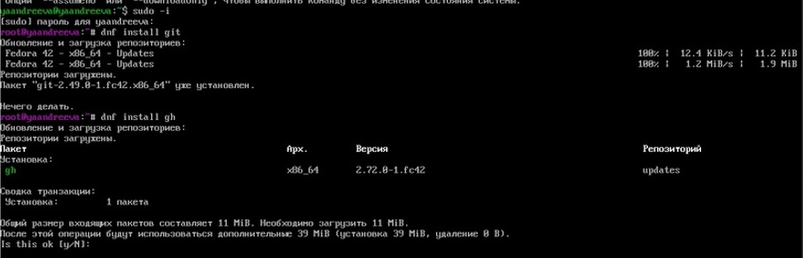

---
## Front matter
title: "Лабораторная работа № 2"
subtitle: "Первоначальная настройка git"
author: "Андреева Яна"
## Generic otions
lang: ru-RU
toc-title: "Содержание"

## Bibliography
bibliography: bib/cite.bib
csl: pandoc/csl/gost-r-7-0-5-2008-numeric.csl

## Pdf output format
toc: true # Table of contents
toc-depth: 2
lof: true # List of figures
lot: true # List of tables
fontsize: 12pt
linestretch: 1.5
papersize: a4
documentclass: scrreprt
## I18n polyglossia
polyglossia-lang:
  name: russian
  options:
   - spelling=modern
   - babelshorthands=true
polyglossia-otherlangs:
  name: English
## I18n babel
babel-lang: russian
babel-otherlangs: English
## Fonts
mainfont: IBM Plex Serif
romanfont: IBM Plex Serif
sansfont: IBM Plex Sans
monofont: IBM Plex Mono
mathfont: STIX Two Math
mainfontoptions: Ligatures=Common,Ligatures=TeX,Scale=0.94
romanfontoptions: Ligatures=Common,Ligatures=TeX,Scale=0.94
sansfontoptions: Ligatures=Common,Ligatures=TeX,Scale=MatchLowercase,Scale=0.94
monofontoptions: Scale=MatchLowercase,Scale=0.94,FakeStretch=0.9
mathfontoptions:
## Biblatex
biblatex: true
biblio-style: "gost-numeric"
biblatexoptions:
  - parentracker=true
  - backend=biber
  - hyperref=auto
  - language=auto
  - autolang=other*
  - citestyle=gost-numeric
## Pandoc-crossref LaTeX customization
figureTitle: "Рис."
tableTitle: "Таблица"
listingTitle: "Листинг"
lofTitle: "Список иллюстраций"
lotTitle: "Список таблиц"
lolTitle: "Листинги"
## Misc options
indent: true
header-includes:
  - \usepackage{indentfirst}
  - \usepackage{float} # keep figures where there are in the text
  - \floatplacement{figure}{H} # keep figures where there are in the text
---

# Цель работы

Изучить идеологию и применение средств контроля версий и освоить умения по работе с git.

# Задание

Создать базовую конфигурацию для работы с git.
Создать ключ SSH.
Создать ключ PGP.
Настроить подписи git.
Зарегистрироваться на Github.
Создать локальный каталог для выполнения заданий по предмету.

# Теоретическое введение

Системы контроля версий. Общие понятия

Системы контроля версий (Version Control System, VCS) применяются при работе нескольких человек над одним проектом. Обычно основное дерево проекта хранится в локальном или удалённом репозитории, к которому настроен доступ для участников проекта. При внесении изменений в содержание проекта система контроля версий позволяет их фиксировать, совмещать изменения, произведённые разными участниками проекта, производить откат к любой более ранней версии проекта, если это требуется.

В классических системах контроля версий используется централизованная модель, предполагающая наличие единого репозитория для хранения файлов. Выполнение большинства функций по управлению версиями осуществляется специальным сервером. Участник проекта (пользователь) перед началом работы посредством определённых команд получает нужную ему версию файлов. После внесения изменений, пользователь размещает новую версию в хранилище. При этом предыдущие версии не удаляются из центрального хранилища и к ним можно вернуться в любой момент. Сервер может сохранять не полную версию изменённых файлов, а производить так называемую дельта-компрессию — сохранять только изменения между последовательными версиями, что позволяет уменьшить объём хранимых данных.

Системы контроля версий поддерживают возможность отслеживания и разрешения конфликтов, которые могут возникнуть при работе нескольких человек над одним файлом. Можно объединить (слить) изменения, сделанные разными участниками (автоматически или вручную), вручную выбрать нужную версию, отменить изменения вовсе или заблокировать файлы для изменения. В зависимости от настроек блокировка не позволяет другим пользователям получить рабочую копию или препятствует изменению рабочей копии файла средствами файловой системы ОС, обеспечивая таким образом, привилегированный доступ только одному пользователю, работающему с файлом.

Системы контроля версий также могут обеспечивать дополнительные, более гибкие функциональные возможности. Например, они могут поддерживать работу с несколькими версиями одного файла, сохраняя общую историю изменений до точки ветвления версий и собственные истории изменений каждой ветви. Кроме того, обычно доступна информация о том, кто из участников, когда и какие изменения вносил. Обычно такого рода информация хранится в журнале изменений, доступ к которому можно ограничить.

В отличие от классических, в распределённых системах контроля версий центральный репозиторий не является обязательным.

Среди классических VCS наиболее известны CVS, Subversion, а среди распределённых — Git, Bazaar, Mercurial. Принципы их работы схожи, отличаются они в основном синтаксисом используемых в работе команд.

Примеры использования git

Система контроля версий Git представляет собой набор программ командной строки. Доступ к ним можно получить из терминала посредством ввода команды git с различными опциями.
Благодаря тому, что Git является распределённой системой контроля версий, резервную копию локального хранилища можно сделать простым копированием или архивацией.
Основные команды git

Перечислим наиболее часто используемые команды git.

Создание основного дерева репозитория:

git init

Получение обновлений (изменений) текущего дерева из центрального репозитория:

git pull

Отправка всех произведённых изменений локального дерева в центральный репозиторий:

git push

Просмотр списка изменённых файлов в текущей директории:

git status

Просмотр текущих изменений:

git diff

Сохранение текущих изменений:

    добавить все изменённые и/или созданные файлы и/или каталоги:

    git add .

    добавить конкретные изменённые и/или созданные файлы и/или каталоги:

    git add имена_файлов

    удалить файл и/или каталог из индекса репозитория (при этом файл и/или каталог остаётся в локальной директории):

    git rm имена_файлов

Сохранение добавленных изменений:

    сохранить все добавленные изменения и все изменённые файлы:

    git commit -am 'Описание коммита'

    сохранить добавленные изменения с внесением комментария через встроенный редактор:

    git commit

    создание
19:57

новой ветки, базирующейся на текущей:

    git checkout -b имя_ветки

    переключение на некоторую ветку:

    git checkout имя_ветки

        (при переключении на ветку, которой ещё нет в локальном репозитории, она будет создана и связана с удалённой)

    отправка изменений конкретной ветки в центральный репозиторий:

    git push origin имя_ветки

    слияние ветки с текущим деревом:

    git merge --no-ff имя_ветки

Удаление ветки:

    удаление локальной уже слитой с основным деревом ветки:

    git branch -d имя_ветки

    принудительное удаление локальной ветки:

    git branch -D имя_ветки

    удаление ветки с центрального репозитория:

    git push origin :имя_ветки
Стандартные процедуры работы при наличии центрального репозитория

Работа пользователя со своей веткой начинается с проверки и получения изменений из центрального репозитория (при этом в локальное дерево до начала этой процедуры не должно было вноситься изменений):

git checkout master
git pull
git checkout -b имя_ветки

Затем можно вносить изменения в локальном дереве и/или ветке.

После завершения внесения какого-то изменения в файлы и/или каталоги проекта необходимо разместить их в центральном репозитории. Для этого необходимо проверить, какие файлы изменились к текущему моменту:

git status

При необходимости удаляем лишние файлы, которые не хотим отправлять в центральный репозиторий.

Затем полезно просмотреть текст изменений на предмет соответствия правилам ведения чистых коммитов:

git diff

Если какие-либо файлы не должны попасть в коммит, то помечаем только те файлы, изменения которых нужно сохранить. Для этого используем команды добавления и/или удаления с нужными опциями:

git add …  
git rm …

Если нужно сохранить все изменения в текущем каталоге, то используем:

git add .

Затем сохраняем изменения, поясняя, что было сделано:

git commit -am "Some commit message"

Отправляем изменения в центральный репозиторий:

git push origin имя_ветки

или

git push
Работа с локальным репозиторием

Создадим локальный репозиторий.

Сначала сделаем предварительную конфигурацию, указав имя и email владельца репозитория:

git config --global user.name "Имя Фамилия"
git config --global  user.email "work@mail"

Настроим utf-8 в выводе сообщений git:

git config --global quotepath false

Для инициализации локального репозитория, расположенного, например, в каталоге ~/tutorial, необходимо ввести в командной строке:

cd 
mkdir tutorial
cd tutorial
git init

После это в каталоге tutorial появится каталог .git, в котором будет храниться история изменений.

Создадим тестовый текстовый файл hello.txt и добавим его в локальный репозиторий:

echo 'hello world' > hello.txt
git add hello.txt
git commit -am 'Новый файл'

Воспользуемся командой status для просмотра изменений в рабочем каталоге, сделанных с момента последней ревизии:

git status

Во время работы над проектом так или иначе могут создаваться файлы, которые не требуется добавлять в последствии в репозиторий. Например, временные файлы, создаваемые редакторами, или объектные файлы, создаваемые компиляторами. Можно прописать шаблоны игнорируемых при добавлении в репозиторий типов файлов в файл .gitignore с помощью сервисов. Для этого сначала нужно получить список имеющихся шаблонов:

curl -L -s https://www.gitignore.io/api/list

Затем скачать шаблон, например, для C и C++

curl -L -s https://www.gitignore.io/api/c >> .gitignore
curl -L -s https://www.gitignore.io/api/c++ >> .gitignore

# Выполнение лабораторной работы

Установка программного обеспечения
	Установим git:
	dnf install git
	и установим gh
	dnf install gh

Базовая настройка git
	Зададим имя и email владельца репозитория:
	git config --global user.name "Name Surname"
	git config --global user.email "work@mail"
	Настроим utf-8 в выводе сообщений git:
	git config --global core.quotepath false
	Зададим имя начальной ветки (будем называть её master):
	git config --global init.defaultBranch master
	Параметр autocrlf:
	git config --global core.autocrlf input
	Параметр safecrlf:
	git config --global core.safecrlf warn

Создадим ключи ssh
	по алгоритму rsa с ключём размером 4096 бит:
	ssh-keygen -t rsa -b 4096
	по алгоритму ed25519:
	ssh-keygen -t ed25519

Создадим ключи pgp
	Генерируем ключ
	gpg --full-generate-key
	Из предложенных опций выбираем:
	тип RSA and RSA;
	размер 4096;
	выберем срок действия; значение по умолчанию — 0 (срок
	действия не истекает никогда).
	GPG запросит личную информацию, которая сохранится в ключе:
	Имя (не менее 5 символов).
	Адрес электронной почты.

Настройка github
	Создадим учётную запись на https://github.com и заполним основные данные.

Добавление PGP ключа в GitHub
	Выводим список ключей и копируем отпечаток приватного ключа:
	gpg --list-secret-keys --keyid-format LONG

	Cкопируем сгенерированный PGP ключ в буфер обмена:
	gpg --armor --export <PGP Fingerprint> | xclip -sel clip
	Перейдем в настройки GitHub (https://github.com/settings/keys), нажмем на кнопку New GPG key и вставим полученный ключ в поле ввода.

Настройка автоматических подписей коммитов git
	Используя введёный email, укажем Git применять его при подписи коммитов:
	git config --global user.signingkey <PGP Fingerprint>
	git config --global commit.gpgsign true
	git config --global gpg.program $(which gpg2)

Настройка gh
	Для начала необходимо авторизоваться
	gh auth login
	Утилита задаст несколько наводящих вопросов.
	Авторизоваться можно через броузер.

Шаблон для рабочего пространства
	Создадим репозиторий курса на основе шаблона
	mkdir -p ~/work/study/2022-2023/"Операционные системы"
	cd ~/work/study/2022-2023/"Операционные системы"
	gh repo create study_2022-2023_os-intro --template=yamadharma/course-directory-student-template --public
	git clone --recursive git@github.com:<owner>/study_2022-2023_os-intro.git os-intro

	Настроим каталог курса
	Перейдем в каталог курса:
	cd ~/work/study/2022-2023/"Операционные системы"/os-intro
	Удалим лишние файлы:
	rm package.json
	Создадим необходимые каталоги:
	echo os-intro > COURSE
	make

	Отправим файлы на сервер:
	git add .
	git commit -am 'feat(main): make course structure'
	git push

# Контрольные вопросы

1. Что такое системы контроля версий (VCS) и для решения каких задач они предназначаются?
	Системы контроля версий (Version Control Systems) — это инструменты для:
	-отслеживания изменений в файлах (чаще всего — в программном коде),
	-хранения истории изменений,
	-совместной работы над проектами,
	-возможности отката к предыдущим версиям.
2. Объясните следующие понятия VCS и их отношения: хранилище, commit, история, рабочая копия.
	Хранилище (repository) — база данных всех изменений проекта.
	Commit — сохранённое состояние проекта с комментариями, метками времени и автором.
	История (history) — последовательность commit’ов.
	Рабочая копия (working copy) — текущие файлы проекта, с которыми работает пользователь.
3. Что представляют собой и чем отличаются централизованные и децентрализованные VCS? Приведите примеры VCS каждого вида.
	Централизованные VCS — один центральный сервер хранит всё
	(пример: Subversion/SVN).
	Плюсы: всё централизовано.
	Минусы: нельзя работать без подключения.
	Децентрализованные VCS — каждый участник имеет полную копию репозитория (пример: Git).
	Плюсы: автономность, скорость.
	Минусы: немного сложнее в координации.
4. Опишите действия с VCS при единоличной работе с хранилищем.
	Инициализация репозитория: `git init`
	Добавление файлов: `git add`
	Сохранение изменений: `git commit`
	Просмотр истории: `git log`
	Работа с ветками при необходимости: `git branch`, `git checkout`
5. Опишите порядок работы с общим хранилищем VCS.
	Клонирование: `git clone`
	Обновление локальной копии: `git pull`
	Отправка изменений: `git push`
	Разрешение конфликтов при слиянии изменений.
	Использование веток для параллельной работы: `git branch`, `git merge`
6. Каковы основные задачи, решаемые инструментальным средством git?
	Хранение истории изменений
	Ветвление и объединение изменений
	Работа офлайн
	Совместная работа
	Безопасное сохранение и откат версий
7. Назовите и дайте краткую характеристику командам git.
	`git init` — инициализация репозитория
	`git clone` — клонирование репозитория
	`git add` — добавление файлов к коммиту
	`git commit` — сохранение изменений
	`git status` — текущее состояние
	`git log` — история
	`git branch` — работа с ветками
	`git merge` — слияние веток
	`git pull` — получение и объединение изменений
	`git push` — отправка изменений
8. Приведите примеры использования при работе с локальным и удалённым репозиториями.
	Локальный:
	git init
	git add .
	git commit -m "Первый коммит"
	Удалённый:
	git clone git@github.com:user/project.git
	git push origin main
	git pull origin main
9. Что такое и зачем могут быть нужны ветви (branches)?
	Ветви — параллельные версии проекта, которые позволяют:
	-работать над новой функциональностью,
	-исправлять ошибки, не мешая основной версии (main/master),
	-тестировать.
	Примеры:
	git branch feature-x
	git checkout feature-x
10. Как и зачем можно игнорировать некоторые файлы при commit?
	Файлы, которые не нужно отслеживать (например, временные, конфигурации), можно указать в `.gitignore`.
	Пример `.gitignore`:
	*.log
	*.tmp
	.env
	node_modules/

# Выводы

Изучили идеологию и применение средств контроля версий и освоиди умения по работе с git.

# Список литературы
