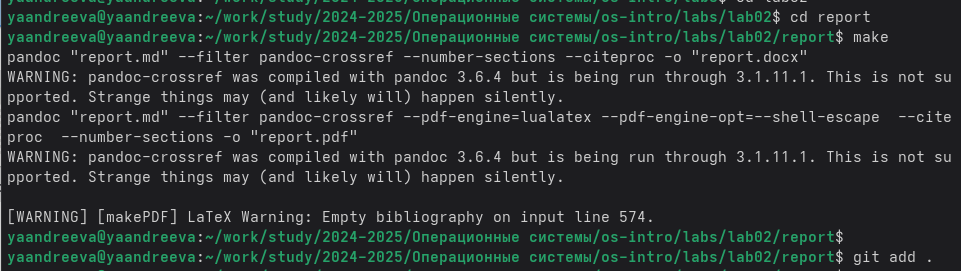
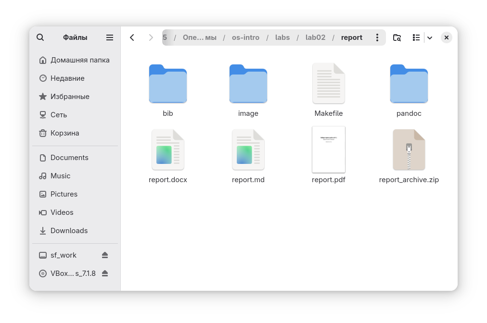

---
## Front matter
title: "Лабораторная работа № 3"
subtitle: "Markdown"
author: "Андреева Яна"

## Generic otions
lang: ru-RU
toc-title: "Содержание"

## Bibliography
bibliography: bib/cite.bib
csl: pandoc/csl/gost-r-7-0-5-2008-numeric.csl

## Pdf output format
toc: true # Table of contents
toc-depth: 2
lof: true # List of figures
lot: true # List of tables
fontsize: 12pt
linestretch: 1.5
papersize: a4
documentclass: scrreprt
## I18n polyglossia
polyglossia-lang:
  name: russian
  options:
  - spelling=modern
  - babelshorthands=true
polyglossia-otherlangs:
  name: English
## I18n babel
babel-lang: russian
babel-otherlangs: English
## Fonts
mainfont: IBM Plex Serif
romanfont: IBM Plex Serif
sansfont: IBM Plex Sans
monofont: IBM Plex Mono
mathfont: STIX Two Math
mainfontoptions: Ligatures=Common,Ligatures=TeX,Scale=0.94
romanfontoptions: Ligatures=Common,Ligatures=TeX,Scale=0.94
sansfontoptions: Ligatures=Common,Ligatures=TeX,Scale=MatchLowercase,Scale=0.94
monofontoptions: Scale=MatchLowercase,Scale=0.94,FakeStretch=0.9
mathfontoptions:
## Biblatex
biblatex: true
biblio-style: "gost-numeric"
biblatexoptions:
  - parentracker=true
  - backend=biber
  - hyperref=auto
  - language=auto
  - autolang=other*
  - citestyle=gost-numeric
## Pandoc-crossref LaTeX customization
figureTitle: "Рис."
tableTitle: "Таблица"
listingTitle: "Листинг"
lofTitle: "Список иллюстраций"
lotTitle: "Список таблиц"
lolTitle: "Листинги"
## Misc options
indent: true
header-includes:
  - \usepackage{indentfirst}
  - \usepackage{float} # keep figures where there are in the text
  - \floatplacement{figure}{H} # keep figures where there are in the text
---

# Цель работы

Научиться оформлять отчеты с помощью легковесного языка разметки Markdown.

# Задание

Сделать отчет по предыдущей лабораторной работе в формате Markdown. В качестве отчета просьба предоставить отчеты в 3 форматах: pdf, docx  md (в архиве, поскольку он должен содержать скриншоты, Makefile).

# Теоретическое введение

Чтобы создать заголовок, используйте знак ( # ), например: 1 # This is heading 1 2 ## This is heading 2 3 ### This is heading 3 4 #### This is heading 4 Чтобы задать для текста полужирное начертание, заключите его в двойные звездочки: 1 This text is bold. Чтобы задать для текста курсивное начертание, заключите его в одинарные звездочки: 1 This text is italic. Чтобы задать для текста полужирное и курсивное начертание, заключите его в тройные звездочки: 1 This is text is both bold and italic. Блоки цитирования создаются с помощью символа >: 1 > The drought had lasted now for ten million years, and the reign of the terrible lizards had long since ended. Here on the Equator, in the continent which would one day be known as Africa, the battle for existence had reached a new climax of ferocity, and the victor was not yet in sight. In this barren and desiccated land, only the small or the swift or the fierce could flourish, or even hope to survive. ↪ ↪ ↪ ↪ ↪ ↪ Неупорядоченный (маркированный) список можно отформатировать с помощью звез- дочек или тире: 1 - List item 1 2 - List item 2 3 - List item 3

# Выполнение лабораторной работы

С помощью команды cd мы перешли в директорию ~/work/study/2022-2023/Операционные системы/os-intro/labs/lab03/report, а затем спомощью команды make создали файлы report.docx report.md report.pdf

# Выводы

Научились оформлять отчеты с помощью легковесного языка разметки Markdown.

# Список литературы
